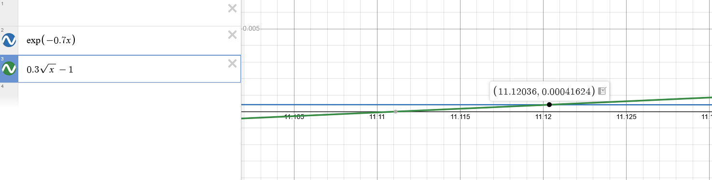

`f(x)=exp(-0.7x)-0.3*sqrt(x)+1`

`f(x) = 0` примерно в 11.12036

`exp(-0.7x)-0.3*sqrt(x)+1=0`

переношу через знак равно часть функции и получаю две подфункции которые пересекаются в какой то точке/точках

`exp(-0.7x)=0.3*sqrt(x)-1`

точка пересечения примерно в 11.12036

возьмем интервал 11.115 11.125

+ [+]центр отрезка: 11.1200000
+ [!]левая точка f(11.1150000) > 0
+ [!]центр f(11.1200000) > 0
+ [!]правая точка f(11.1250000) < 0
+ [i]длина интервала: 0.0050000
+ [+]центр отрезка: 11.1225000
+ [!]левая точка f(11.1200000) > 0
+ [!]центр f(11.1225000) < 0
+ [!]правая точка f(11.1250000) < 0
+ [i]длина интервала: 0.0025000
+ [+]центр отрезка: 11.1212500
+ [!]левая точка f(11.1200000) > 0
+ [!]центр f(11.1212500) < 0
+ [!]правая точка f(11.1225000) < 0
+ [i]длина интервала: 0.0012500
+ [+]центр отрезка: 11.1206250
+ [!]левая точка f(11.1200000) > 0
+ [!]центр f(11.1206250) < 0
+ [!]правая точка f(11.1212500) < 0
+ [i]длина интервала: 0.0006250
+ [+]центр отрезка: 11.1203125
+ [!]левая точка f(11.1200000) > 0
+ [!]центр f(11.1203125) > 0
+ [!]правая точка f(11.1206250) < 0
+ [i]длина интервала: 0.0003125
+ [+]центр отрезка: 11.1204688
+ [!]левая точка f(11.1203125) > 0
+ [!]центр f(11.1204688) < 0
+ [!]правая точка f(11.1206250) < 0
+ [i]длина интервала: 0.0001562
+ [+]центр отрезка: 11.1203906
+ [!]левая точка f(11.1203125) > 0
+ [!]центр f(11.1203906) < 0
+ [!]правая точка f(11.1204688) < 0
+ [i]длина интервала: 0.0000781
+ [+]центр отрезка: 11.1203516
+ [!]левая точка f(11.1203125) > 0
+ [!]центр f(11.1203516) > 0
+ [!]правая точка f(11.1203906) < 0
+ [i]длина интервала: 0.0000391
+ [+]центр отрезка: 11.1203711
+ [!]левая точка f(11.1203516) > 0
+ [!]центр f(11.1203711) < 0
+ [!]правая точка f(11.1203906) < 0
+ [i]длина интервала: 0.0000195
+ [+]центр отрезка: 11.1203613
+ [!]левая точка f(11.1203516) > 0
+ [!]центр f(11.1203613) > 0
+ [!]правая точка f(11.1203711) < 0
+ [i]длина интервала: 0.0000098
+ [+]центр отрезка: 11.1203662
+ [!]левая точка f(11.1203613) > 0
+ [!]центр f(11.1203662) < 0
+ [!]правая точка f(11.1203711) < 0
+ [i]длина интервала: 0.0000049
+ [+]центр отрезка: 11.1203638
+ [!]левая точка f(11.1203613) > 0
+ [!]центр f(11.1203638) < 0
+ [!]правая точка f(11.1203662) < 0
+ [i]длина интервала: 0.0000024
+ [+]центр отрезка: 11.1203625
+ [!]левая точка f(11.1203613) > 0
+ [!]центр f(11.1203625) > 0
+ [!]правая точка f(11.1203638) < 0
+ [i]длина интервала: 0.0000012
+ [+]центр отрезка: 11.1203632
+ [!]левая точка f(11.1203625) > 0
+ [!]центр f(11.1203632) < 0
+ [!]правая точка f(11.1203638) < 0
+ [i]длина интервала: 0.0000006
+ [+]центр отрезка: 11.1203629
+ [!]левая точка f(11.1203625) > 0
+ [!]центр f(11.1203629) < 0
+ [!]правая точка f(11.1203632) < 0
+ [i]длина интервала: 0.0000003
+ [+]центр отрезка: 11.1203627
+ [!]левая точка f(11.1203625) > 0
+ [!]центр f(11.1203627) > 0
+ [!]правая точка f(11.1203629) < 0
+ [i]длина интервала: 0.0000002
+ Точка пересечения: 11.1203627777
